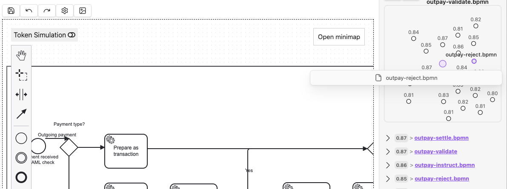

# Smart Connections BPMN

A companion plugin for [Smart Connections](https://github.com/brianpetro/obsidian-smart-connections) that adds BPMN file indexing to your Obsidian vault.

Drop `.bpmn` files into your vault and they become part of your Smart Connections — semantically linked to your notes, searchable, and surfaced in the connections sidebar.



## How it works

The plugin registers a BPMN source adapter into [Smart Environment](https://github.com/brianpetro/obsidian-smart-env), the framework that powers Smart Connections. When Smart Environment indexes your vault, it uses this adapter to parse `.bpmn` files and produce structured text for embedding.

**What gets extracted from BPMN XML:**

- Process names and documentation
- Tasks (user, service, script, manual, send, receive, business rule)
- Sub-processes
- Start, end, and intermediate events
- Gateways (exclusive, parallel, inclusive, event-based, complex)
- Data objects and data stores
- Named sequence flows (conditions)
- Text annotations
- `[[wiki-links]]` in documentation elements become outlinks to vault notes

The extracted text is converted to structured markdown, embedded by Smart Connections' model, and matched against your notes using semantic similarity.

## Requirements

- [Smart Connections](https://github.com/brianpetro/obsidian-smart-connections) plugin installed and enabled (v4.0+)
- Obsidian v1.1.0+

## Installation

### Manual install

1. Download `main.js`, `manifest.json`, and `styles.css` from the [latest release](https://github.com/S1ngl3-x/obsidian-smart-connections-bpmn/releases)
2. Create a folder in your vault: `.obsidian/plugins/smart-connections-bpmn/`
3. Copy the three files into that folder
4. Open Obsidian Settings > Community plugins
5. Enable **Smart Connections BPMN**

### Build from source

```bash
git clone https://github.com/S1ngl3-x/obsidian-smart-connections-bpmn.git
cd obsidian-smart-connections-bpmn
npm install
npm run build
```

Then copy `main.js`, `manifest.json`, and `styles.css` to `.obsidian/plugins/smart-connections-bpmn/` in your vault.

## Verifying it works

Open the Obsidian developer console (`Cmd+Option+I` on Mac, `Ctrl+Shift+I` on Windows/Linux) and look for:

```
Smart Connections BPMN: Registered .bpmn adapter
```

Once Smart Environment finishes indexing, BPMN files will appear in the connections sidebar when they're semantically related to the note you're viewing.

## Example output

A BPMN file like `outpay-initiate.bpmn` gets parsed into:

```markdown
# Process: Initiate 3rd party outgoing single currency payment

## Tasks
- Add SWIFT payment type (businessRuleTask)
- Notify client to top up funds (serviceTask)
- Add domestic payment options (businessRuleTask)
- Fill additional payment details (userTask)
- Submit payment (userTask)
- Revise outgoing payment (manualTask)

## Sub-Processes
- Fill info for payment type decision

## Events
- Start: User entered Send Payment section
- End: Payment order request submitted
- End: Abort payment

## Gateways
- Inclusive: Locality of the payment?
- Exclusive: (unnamed)

## Annotations
- "add for each shared group"
```

## Architecture

This plugin is a lightweight companion — it contains no UI of its own. It uses the Smart Environment [adapter pattern](https://github.com/brianpetro/jsbrains/tree/main/smart-sources/adapters) to register a `.bpmn` file handler alongside the built-in markdown, canvas, and excalidraw adapters.

```
Smart Connections (main plugin)
  └── Smart Environment
        └── smart-sources
              ├── md   → MarkdownSourceContentAdapter
              ├── canvas → CanvasSourceContentAdapter
              ├── excalidraw.md → ExcalidrawSourceContentAdapter
              └── bpmn → BpmnSourceContentAdapter  ← this plugin
```

## Credits

Built on top of the [Smart Connections](https://github.com/brianpetro/obsidian-smart-connections) ecosystem by [Brian Petro](https://github.com/brianpetro). Smart Connections, Smart Environment, and the jsbrains framework make this kind of extension possible through their clean adapter architecture.

- [Smart Connections](https://github.com/brianpetro/obsidian-smart-connections) — the parent plugin
- [jsbrains](https://github.com/brianpetro/jsbrains) — the core framework (smart-sources, smart-entities, smart-environment)
- [obsidian-smart-env](https://github.com/brianpetro/obsidian-smart-env) — the Obsidian bridge

## License

[MIT](LICENSE)
